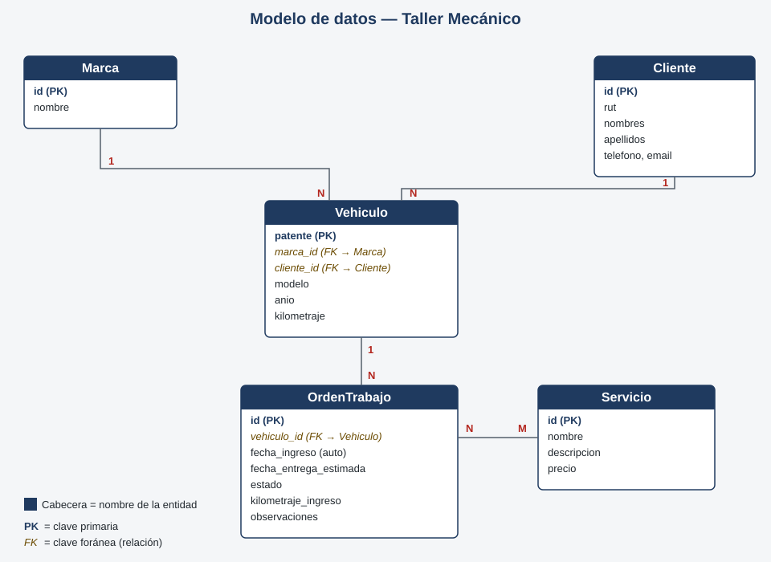

# Taller Mecánico — Django MVT

Aplicación web para administrar un taller mecánico: clientes, sus vehículos, el catálogo de
servicios que ofrece el taller y las órdenes de trabajo que se generan sobre cada vehículo.

Proyecto desarrollado para la evaluación **Taller evaluado: aplicación web con Django bajo el
patrón MVT** (Desarrollo Web y Aplicaciones Móviles).

## Integrante

- Ignacia Bazán — i.baznconcha@uandresbello.edu

## Dominio y entidades

El dominio elegido es un **taller mecánico**. Las entidades y sus relaciones son:

| Entidad | Descripción |
|---|---|
| `Marca` | Marca del vehículo (ej. Toyota, Chevrolet). |
| `Cliente` | Dueño del vehículo, con RUT, nombre, teléfono y correo. |
| `Vehiculo` | Vehículo de un cliente, asociado a una marca. La patente es su clave primaria. |
| `Servicio` | Servicio que ofrece el taller (ej. cambio de aceite), con precio. |
| `OrdenTrabajo` | Orden de trabajo abierta sobre un vehículo, con uno o más servicios asociados. |

**Relaciones:**

- `Vehiculo.marca` → `Marca` (ForeignKey, 1:N)
- `Vehiculo.cliente` → `Cliente` (ForeignKey, 1:N)
- `OrdenTrabajo.vehiculo` → `Vehiculo` (ForeignKey, 1:N)
- `OrdenTrabajo.servicios` → `Servicio` (ManyToManyField, N:M)

### Justificación de cada `on_delete`

- **`Vehiculo.marca` → `PROTECT`**: no se debe poder eliminar una marca mientras existan vehículos
  registrados con ella. Si se permitiera, esos vehículos quedarían sin marca. Antes de borrar una
  marca hay que reasignar o eliminar los vehículos asociados.
- **`Vehiculo.cliente` → `PROTECT`**: un cliente no se puede eliminar si todavía tiene vehículos
  registrados a su nombre, porque se perdería la trazabilidad del historial del taller sobre esos
  vehículos. Hay que dar de baja o reasignar el vehículo primero.
- **`OrdenTrabajo.vehiculo` → `CASCADE`**: una orden de trabajo no tiene sentido sin el vehículo al
  que pertenece. Si se elimina un vehículo, no interesa conservar órdenes huérfanas que ya no se
  pueden asociar a nada, por lo que se eliminan junto con él.

> Cada integrante debe poder explicar estas decisiones con sus propias palabras en la defensa.

## Arquitectura

Sigue el patrón MVT estándar de Django:

```
TallerMecanico/
    manage.py
    requirements.txt
    .env.example
    .gitignore
    README.md
    TallerMecanico/        # configuración: settings.py, urls.py
    Mecanica/               # app principal
        models.py           # el MODELO
        views.py             # las VISTAS (controlador)
        urls.py               # rutas propias de la app
        admin.py
        migrations/
        templates/Mecanica/   # las PLANTILLAS
        static/Mecanica/       # css y js
```

## Motor de base de datos

El proyecto usa **PostgreSQL** (no SQLite). Las credenciales se leen desde variables de entorno
mediante un archivo `.env` (excluido del repositorio vía `.gitignore`).

### 1. Crear la base de datos y el usuario

Con `psql` conectado como superusuario de PostgreSQL:

```sql
CREATE DATABASE taller_mecanico;
CREATE USER taller_user WITH PASSWORD 'una_password_segura';
GRANT ALL PRIVILEGES ON DATABASE taller_mecanico TO taller_user;
ALTER DATABASE taller_mecanico OWNER TO taller_user;
```

### 2. Configurar el `.env`

Copia `.env.example` a `.env` y completa los valores según lo creado en el paso anterior:

```
DB_NAME=taller_mecanico
DB_USER=taller_user
DB_PASSWORD=una_password_segura
DB_HOST=localhost
DB_PORT=5432
DJANGO_SECRET_KEY=<una clave secreta cualquiera>
```

## Instalación paso a paso

```bash
# 1. Clonar el repositorio
git clone <URL_DEL_REPOSITORIO>
cd TallerMecanico

# 2. Crear y activar entorno virtual
python -m venv venv
venv\Scripts\activate          # Windows
# source venv/bin/activate     # Linux/Mac

# 3. Instalar dependencias
pip install -r requirements.txt

# 4. Configurar variables de entorno
copy .env.example .env         # Windows
# cp .env.example .env         # Linux/Mac
# editar .env con los datos de tu base de datos local

# 5. Aplicar migraciones
python manage.py migrate

# 6. Crear un superusuario
python manage.py createsuperuser

# 7. Levantar el servidor
python manage.py runserver
```

Luego abre `http://127.0.0.1:8000/`. Sin sesión iniciada, se redirige automáticamente al login.

## Usuarios de prueba

| Usuario | Contraseña | Rol |
|---|---|---|
| administrador | admin123 | Superusuario, accede también a `/admin/` |
| `mecanico1` | *mecanico1* | Usuario común, sin acceso al panel de administración |

> Completar esta tabla con las credenciales reales antes de la entrega. Crear el usuario común con
> `python manage.py createsuperuser` (para el admin) y `python manage.py shell` o el panel
> `/admin/` (para el usuario común, sin marcar "staff").

## Diagrama del modelo de datos



Entidades, atributos y cardinalidades de las relaciones (1:N entre `Marca`/`Cliente` y `Vehiculo`,
1:N entre `Vehiculo` y `OrdenTrabajo`, N:M entre `OrdenTrabajo` y `Servicio`).

## Datos de prueba

La base de datos incluye 24 registros reales repartidos entre las 5 entidades (marcas, clientes,
vehículos, servicios y órdenes de trabajo), cargados desde el panel de administración. El respaldo
completo se entrega en `respaldo.sql`, generado con `pg_dump`:

```powershell
& "C:\Program Files\PostgreSQL\18\bin\pg_dump.exe" -U <tu_usuario> -d <tu_base> -f respaldo.sql --no-owner --no-privileges
```

Para restaurarlo en una base de datos nueva y vacía:

```powershell
& "C:\Program Files\PostgreSQL\18\bin\psql.exe" -U <tu_usuario> -d <tu_base> -f respaldo.sql
```

## Estado del proyecto

Funcional de principio a fin: modelo de datos, autenticación, arquitectura MVT, CRUD completo con
validación JavaScript, panel de administración y datos de prueba cargados.
